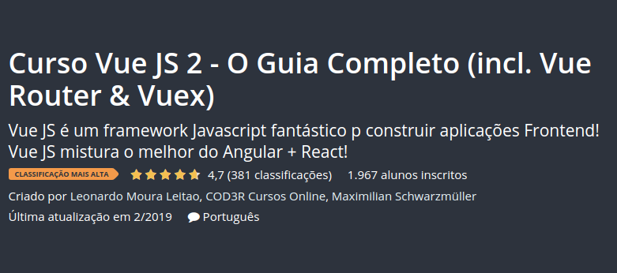

# O que você indicaria para alguém que queira aprender Vue.js?

### Esta convesa aconteceu em um grupo de Whatsapp sobre *[Vue](https://br.vuejs.org/index.html)*.

# 

- [22:55, 14/2/2019] +55 ...: *Fala guys, boa noite. Alguem indica um bom curso de Vue?*

> [23:19, 14/2/2019] Eu: **Sim**

> [23:19, 14/2/2019] Eu: **Perai**

> [23:19, 14/2/2019] Eu: **Pode investir um pouco?**

> [23:21, 14/2/2019] Eu: **se puder, esse: [Udemy - Curso Vue JS 2 - O Guia Completo](https://www.udemy.com/vue-js-completo/)**

	

	

	

	
> [23:21, 14/2/2019] Eu: **RS 24 é barato demais pelo conteúdo**

> [23:22, 14/2/2019] Eu: **se não quiser gastar, [Vue.js 2 - Getting Started](https://www.youtube.com/playlist?list=PL55RiY5tL51p-YU-Uw90qQH419BM4Iz07)**

	

	

> [23:23, 14/2/2019] Eu: **em inglês**

> [23:23, 14/2/2019] Eu: **mas muito bom**

> [23:23, 14/2/2019] Eu: **e um inglês fácil de entender**

> [23:25, 14/2/2019] Eu: **[Vue JS Crash Course - 2019](https://www.youtube.com/watch?v=Wy9q22isx3U)**

	

	

> [23:25, 14/2/2019] Eu: **em inglês tambem**

> [23:25, 14/2/2019] Eu: **facil de entender**

> [23:25, 14/2/2019] Eu: **muito bom**

> [23:26, 14/2/2019] Eu: **1h e pouco de vídeo só sobre vue, aquele resumão intensivo**

> [23:28, 14/2/2019] Eu: **https://www.youtube.com/playlist?list=PLFJmwzuHdBRTN93itG0UiZpqs8ZnBSeEF**

> [23:28, 14/2/2019] Eu: **Playlist do Vedovelli**

> [23:28, 14/2/2019] Eu: **pt-br**

> [23:30, 14/2/2019] Eu: **https://www.youtube.com/playlist?list=PLy5T05I_eQYMoDJelUvWR6EhOnnAdiMHv**

> [23:31, 14/2/2019] Eu: **do Vinicius Reis, que fazia parte do Codecasts com o Vedovelli**

> [23:32, 14/2/2019] Eu: **todos muito bons**
	

# 

**E você, o que tem a indicar pra quem quer aprender [Vue.js](https://vuejs.org/)?**