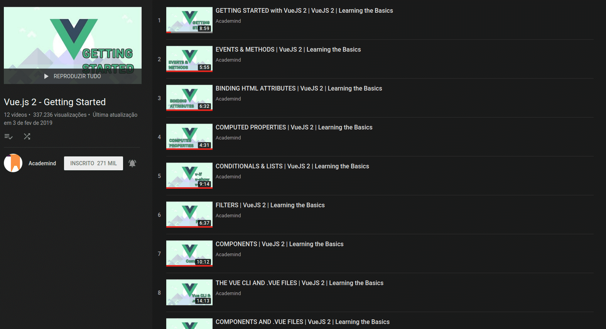
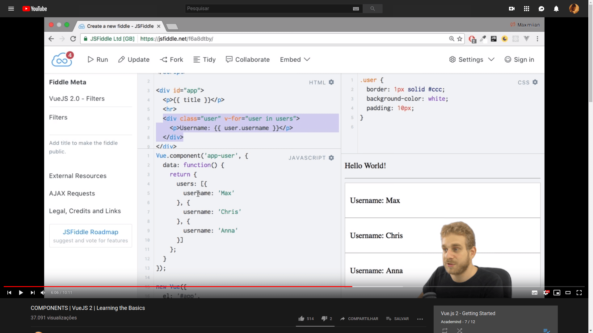
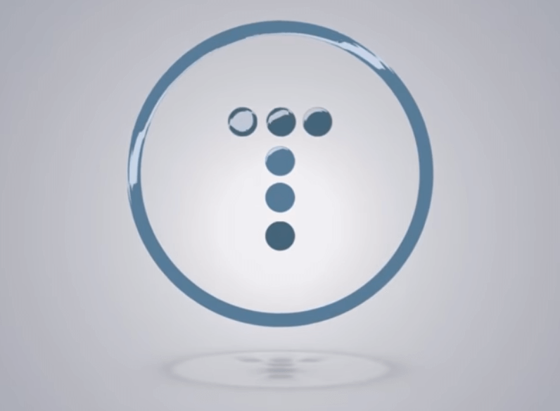
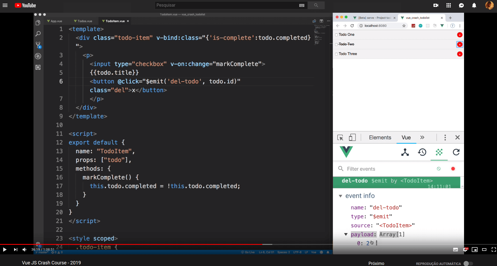
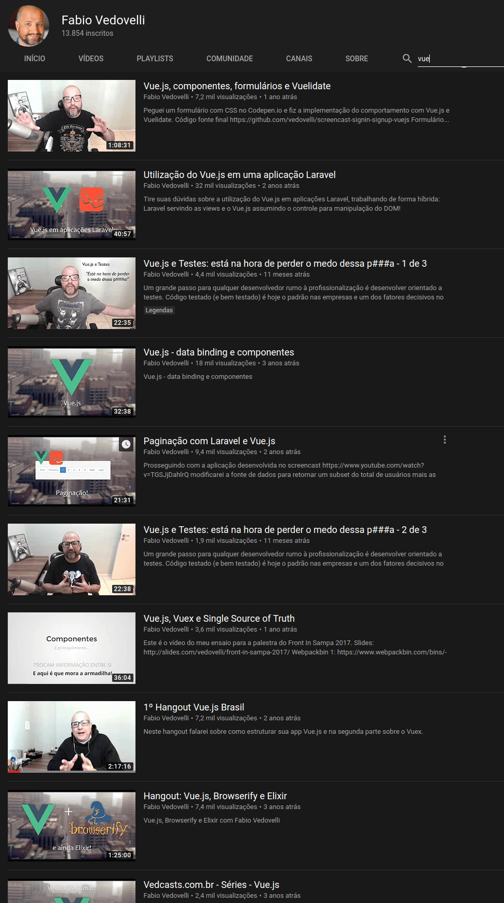

# O que você indicaria a alguém que quer aprender Vue.js?

&nbsp;
#### Esta convesa aconteceu em um grupo de Whatsapp sobre *<a href="https://br.vuejs.org/index.html" title="Vue" target="_blank">Vue</a>*.

# 

- [22:55, 14/2/2019] +55 ...: *Fala guys, boa noite. Alguem indica um bom curso de Vue?*

> [23:19, 14/2/2019] Eu: **Sim**

> [23:19, 14/2/2019] Eu: **Peraí**

> [23:19, 14/2/2019] Eu: **Pode investir um pouco de dinheiro?**

> [23:21, 14/2/2019] Eu: **se puder, indico este: <a href="https://www.udemy.com/vue-js-completo/" title="Udemy - Curso Vue JS 2 - O Guia Completo" target="_blank">Udemy - Curso Vue JS 2 - O Guia Completo</a>**

	

	

	

	
> [23:21, 14/2/2019] Eu: **R$ 24 é barato demais pelo conteúdo**

> [23:22, 14/2/2019] Eu: **se não quiser gastar, <a href="https://www.youtube.com/playlist?list=PL55RiY5tL51p-YU-Uw90qQH419BM4Iz07" title="Vue.js 2 - Getting Started" target="_blank">Vue.js 2 - Getting Started</a>**

	

	

> [23:23, 14/2/2019] Eu: **em inglês**

> [23:23, 14/2/2019] Eu: **muito bom**

> [23:23, 14/2/2019] Eu: **é um inglês fácil de compreender**

> [23:25, 14/2/2019] Eu: **<a href="https://www.youtube.com/watch?v=Wy9q22isx3U" title="Vue JS Crash Course - 2019" target="_blank">Vue JS Crash Course - 2019</a>**

	

	

> [23:25, 14/2/2019] Eu: **em inglês também**

> [23:25, 14/2/2019] Eu: **fácil de entender**

> [23:25, 14/2/2019] Eu: **muito bom**

> [23:26, 14/2/2019] Eu: **mais de 1h de vídeo só sobre vue, aquele resumão intensivo**

> [23:28, 14/2/2019] Eu: **o Canal do <a href="https://www.youtube.com/user/vedovelli/search?query=vue" title="Fabio Vedovelli" target="_blank">Fabio Vedovelli</a>**

	

> [23:28, 14/2/2019] Eu: **pt-br**

> [23:30, 14/2/2019] Eu: **a série <a href="https://www.youtube.com/playlist?list=PLy5T05I_eQYMoDJelUvWR6EhOnnAdiMHv" title="Vue init (Vue v1)" target="_blank">Vue init (Vue v1)</a>**

	

> [23:31, 14/2/2019] Eu: **do Vinicius Reis, que fazia parte do <a href="https://blog.codecasts.com.br/" title="Codecasts" target="_blank">Codecasts</a> com o Vedovelli**

> [23:31, 14/2/2019] Eu: **tem também os cursos do Canal <a href="https://www.youtube.com/user/rimorsoft/playlists" title="Rimorsoft Online" target="_blank">Rimorsoft Online</a>**

	

> [23:31, 14/2/2019] Eu: **em espanhol, muito fácil de entender**

> [23:32, 14/2/2019] Eu: **indico praticamente todas as playlists de Vue desse canal, é explicado de maneira muito clara, simples e objetiva**

> [23:34, 14/2/2019] Eu: **tem o curso/playlist do Laracasts <a href="https://www.youtube.com/playlist?list=PL3VM-unCzF8iRyPotjFsgy7EfuCITvr_3" title="Learn Vue 2: Step By Step" target="_blank">Learn Vue 2: Step By Step</a>**

	

> [23:34, 14/2/2019] Eu: **em ingês, excelente curso**

> [23:35, 14/2/2019] Eu: **enfim, todos muito bons!**

# 

**E você, o que tem a indicar pra quem quer aprender <a href="https://vuejs.org/" title="Vue.js" target="_blank">Vue.js</a>?**

\#vue \#vuejs \#vue.js \#webdev